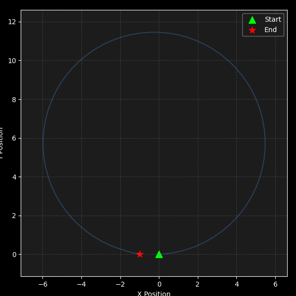
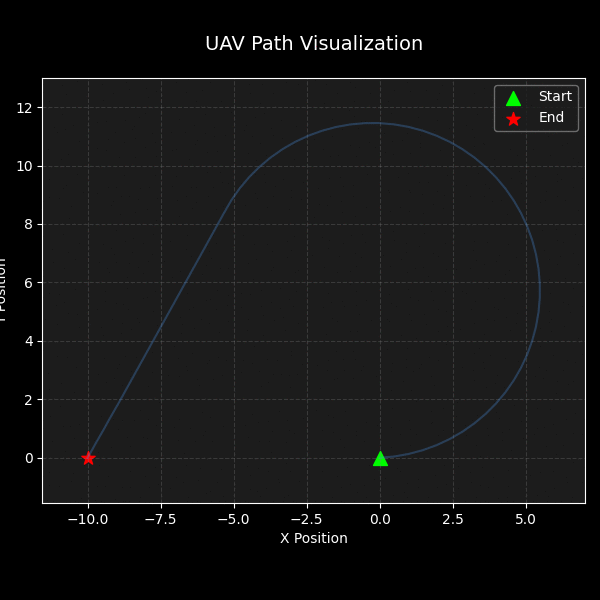
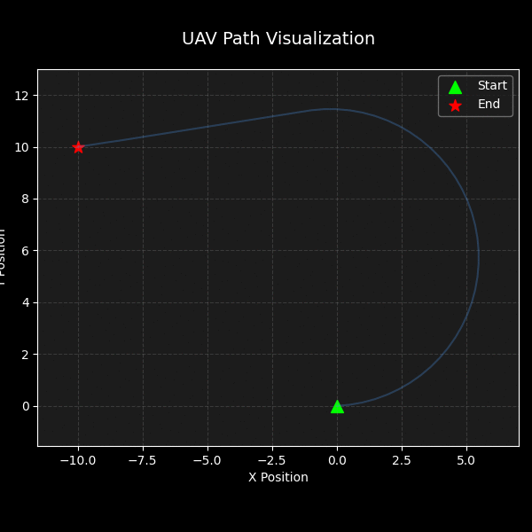
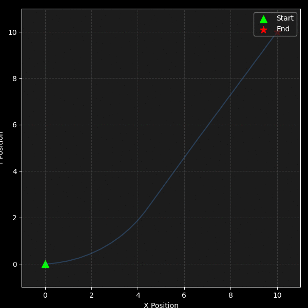
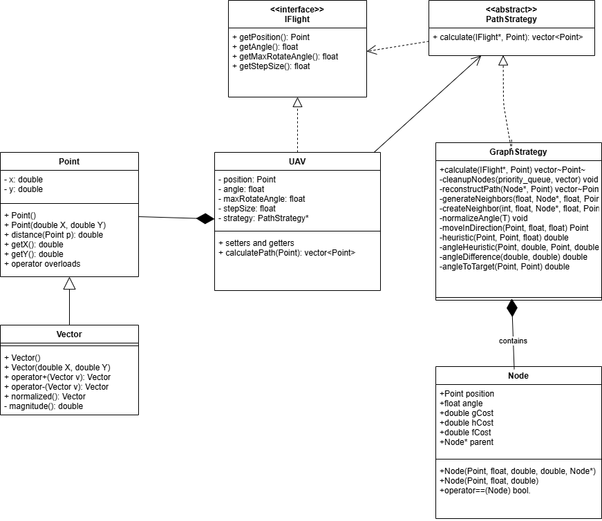

# UAV Pathfinding Simulation

## Overview
This project uses advanced pathfinding algorithms to simulate a UAV (Unmanned Aerial Vehicle) navigating in a 2D space. The core functionality is built around modular, object-oriented design principles, allowing flexible configuration and extension.

The UAV leverages algorithms like A* and Greedy Best-First Search (GBFS) to calculate optimal or near-optimal paths to a given destination, considering movement constraints such as angle limits and step sizes. The system is designed to be efficient, maintainable, and easily extensible for future enhancements.






## Features
- **Pathfinding Algorithms:** Implements A* and GBFS algorithms for efficient path calculations.
- **Customizable Path Strategy:** Modular design allows easy swapping of pathfinding strategies.
- **2D Space Navigation:** Supports UAV movement simulation with configurable step size and rotation constraints.
- **Reusable Components:** Includes generic utilities.
- **Comprehensive Error Handling:** Handles invalid states gracefully to prevent crashes.
- **Real-time visualization of UAV movement:** Introduce a Python script to execute the C++ program and simulate the UAV's path in a graphical view.

## Architecture


### Key Classes
1. **Point**
   - Represents a point in 2D space.
   - Provides basic operations like addition, subtraction, and scalar multiplication.
   - Calculates the distance between points.

2. **Vector**
   - Inherits from `Point` to represent 2D vectors.
   - Adds functionality for normalization and magnitude calculation.

3. **Node**
   - Represents a node in the A* pathfinding algorithm.
   - Contains the following properties:
     - **position:** Point representing the node's location in 2D space
     - **angle:**  indicating the direction of movement
     - **gCost:** representing the cost from start node to current node
     - **hCost:** representing the estimated cost from current node to goal
     - **fCost:** representing total cost (gCost + hCost)
     - **parent:** Pointer to the parent Node for path reconstruction

4. **PathStrategy (Interface)**
   - Abstract interface for pathfinding strategies.
   - Allows the use of different algorithms for path calculation.
     
5. **GraphStrategy**
   - Implements pathfinding logic (PathStrategy Interface) using A* and GBFS algorithms.
   - Defines private helper methods for heuristic calculations, neighbor generation, and path reconstruction.

6. **UAV**
   - Represents a UAV navigating in 2D space.
   - Encapsulates key properties:
     - **Position:** Current location in 2D space.
     - **Angle:** Current direction of movement.
     - **Movement Constraints:** Includes maximum rotation angle and fixed step size.
   - Delegates path calculation to a configurable `PathStrategy`, enabling flexibility in choosing algorithms.

7. **IFlight (Interface)**
   - Defines UAV-related properties for path calculation.
   - Ensures a standardized interface for interacting with pathfinding algorithms.


## Prerequisites
- **Compiler:** Requires a C++ compiler and Python interpreter for the simulation view.

## Getting Started

This project consists of a **C++ program** that calculates the UAV path using the A* and GBFS algorithms and a **Python script** that:
1. Executes the compiled C++ executable to calculate the UAV's path.
2. Visualizes the calculated path as an animated simulation.

If you are using Visual Studio or another IDE, you can simply build the C++ project, ensure the executable is generated, and then run the Python script. Alternatively, follow the provided steps to build the project using `cmake` or Docker.

### 1. Clone the Repository
```bash
git clone https://github.com/dotz600/UAVPathSimulation.git
cd UAVPathSimulation
```

### 2. Build the Project

#### Option 1: CMake Build
```bash
mkdir build
cd build
cmake ..
cmake --build .
```

#### Option 2: Docker Build
```bash
# Build Docker image
docker build -t uav-path-simulation .

# Run Docker container
docker run uav-path-simulation

# Copy generated animation to local machine
docker ps -a  # Find container ID
docker cp <container_id>:/app/animation.gif <local_destination>
# Example: docker cp ec165d7cb0b9:/app/animation.gif C:\Users\USER\Downloads\animation.gif
```

### 3. Install Dependencies
```bash
pip install -r requirements.txt
```
Note: When using Docker, all dependencies are pre-installed, so you can skip this step.

### 4. Run the Simulation
```bash
python pathPrinter.py
```

## Usage

### Customizing UAV Parameters
1. Edit `/resources/inputData.txt` to modify:
   - Start point
   - Destination point
   - Current angle - The UAV's initial orientation in degrees (0 corresponds to the X-axis).
   - Maximum rotate angle
   - Step size

### Editing Input Data in Docker
If using Docker:
```bash
# Enter container
docker run -it uav-path-simulation /bin/bash

# Edit input file
nano /app/resources/inputData.txt

# Run simulation
python ./pathPrinter.py
```

## Example Output
The simulation generates a path visualization with coordinates:
```
Calculated Path:
(0,0)
(1,1)
(2,2)
...
(10,10)
```


---


## Extensibility
1. **Add New Pathfinding Algorithms:**
   - Derive a new class from `PathStrategy`.
   - Implement the `calculate` method to define custom logic.

2. **Enhance UAV Behavior:**
   - Extend the `UAV` class to include additional capabilities like obstacle avoidance or 3D movement.
  

